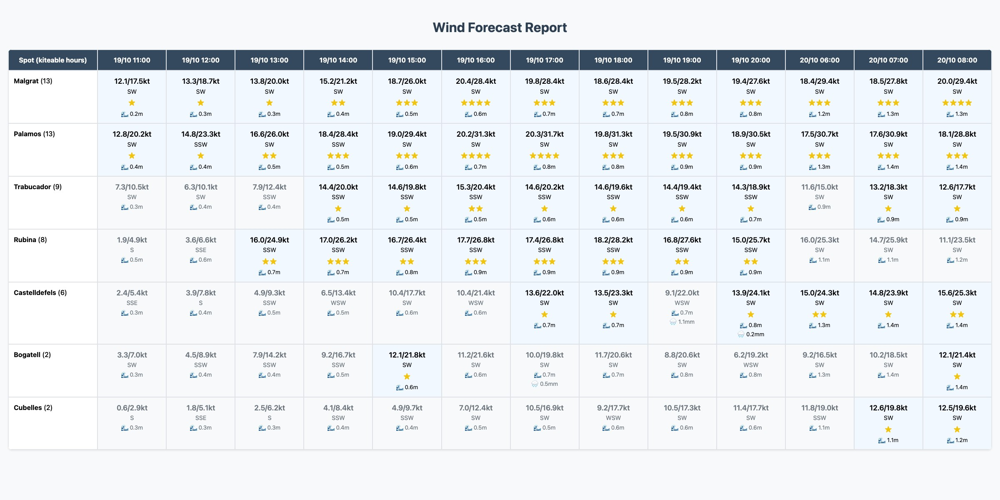

# wind-forecast

[](https://github.com/pmalafosse/wind-forecast/actions/workflows/tests.yml)
[](https://coveralls.io/github/pmalafosse/wind-forecast?branch=main)

A wind forecast analyzer and report generator for kitesurfing conditions. Fetches data from the AROME HD model (hourly + 15-min) and generates interactive HTML reports with clickable per-spot wind charts.



## Features

- Interactive HTML report with kiteable-only and all-conditions views
- Star rating system for wind quality
- 15-minute AROME resolution where available (marked with a blue dot in column headers)
- Clickable spot names open a 15-min wind/gust chart in a modal
- JPG and PDF export
- Wave height and precipitation integration
- Configurable spots, wind sectors, bands, and time windows

## Quick Start

```bash
# Install (Python 3.14, managed by uv)
uv sync --extra dev

# Generate HTML report
uv run windforecast

# Generate per-spot 15-min wind charts
uv run windforecast plot --all
```

## Usage

### Report generation

```bash
uv run windforecast                          # HTML report
uv run windforecast --jpg                    # + JPG snapshot (requires Chrome)
uv run windforecast --pdf                    # + PDF
uv run windforecast --config path/to/config.json
uv run windforecast -v                       # verbose/debug
```

### 15-min wind charts

Generates a wind/gust chart for the current day from the 15-min AROME model, including the model run timestamp.

```bash
# Single spot by name (must exist in config.json)
uv run windforecast plot --spot Bogatell

# All spots from config.json (used by CI to populate plots/)
uv run windforecast plot --all

# Ad-hoc spot not in config
uv run windforecast plot --lat 41.38 --lon 2.21 --name "My Spot"
```

Charts are saved to `out/plots/<spot_name>_15min_today.png`. Clicking a spot name in the HTML report opens the corresponding chart in a modal.

Requires `matplotlib`, included in `uv sync --extra dev`.

## Configuration

`config.json` controls spots, forecast parameters, and conditions. See [docs/configuration.md](docs/configuration.md) for the full reference.

```json
{
  "spots": [{
    "name": "Bogatell",
    "lat": 41.3851,
    "lon": 2.2100,
    "dir_sector": { "start": 225, "end": 45, "wrap": true }
  }],
  "forecast": {
    "model": "arome_france_hd",
    "hourly_vars": "wind_speed_10m,wind_gusts_10m,wind_direction_10m,precipitation",
    "wave_vars": "wave_height",
    "forecast_hours_hourly": 48,
    "forecast_min15": 24
  },
  "time_window": { "day_start": 6, "day_end": 21 },
  "conditions": { "bands": [["too much", 40], ["good", 17], ["light", 12]], "rain_limit": 0.5 }
}
```

## Development

```bash
uv sync --extra dev
uv run pre-commit install

uv run pytest                                # all tests + coverage
uv run pytest tests/test_forecast.py        # single file
uv run pre-commit run --all-files
```

### JPG/PDF generation

Requires Chrome or Chromium (auto-detected). Falls back to `wkhtmltopdf`.

- macOS: `brew install --cask google-chrome`
- Linux: `sudo apt install chromium-browser`

## License

[CC BY-NC 4.0](LICENSE) — share and adapt freely, no commercial use.
